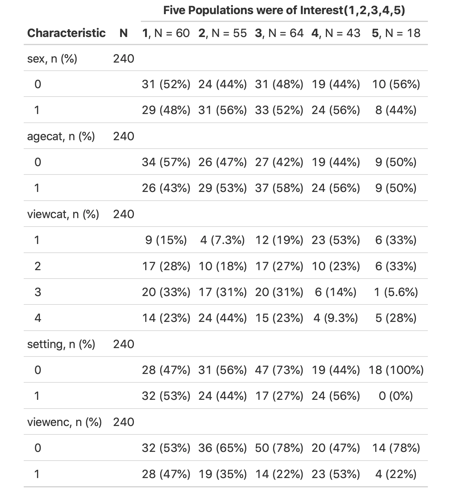

```{r Front Matter, include=FALSE}

# clean up & set default chunk options
rm(list = ls())
knitr::opts_chunk$set(echo = FALSE)

# packages
library(tidyverse) 
library(ggplot2)
library(mosaic)    
library(table1)
library(readxl)
library(car)
library(stargazer)
library(tidyr)
library(MASS)
library(corrplot)
library(table1)
library(gtsummary)
library(interactions) 
library(ggpubr)
library(float)

# user-defined functions

# inputs
sesame = read.csv("sesame.csv") 
```


# Project Description
The producers of Sesame Street and the Educational Testing Service (ETS) conducted a joint study to evaluate the impact of watching Sesame Street in the United States on children's cognitive performance. ETS conducted an experiment in which children from five different family backgrounds in five different locations in the United States were tested on their knowledge of body parts, letters, forms, numbers, relationship terms, and classification skills. The test was administered in two sessions at least 6 months apart. ETS also measured the pretest of the Peabody Picture Vocabulary for the measure of vocabulary maturity and recorded the age of the children (in months.) and gender, as well as the frequency of viewing, location of viewing, and whether or not they were viewencaged to watch Sesame Street.


The client provided part of the raw data from the experiment (see Appendix A for raw data set description) and wanted us to analyze the data to determine if viewing Sesame Street would enhance children's knowledge of body parts, letters, forms, numbers, relational terms, and if there is any area could be focused on for improvement, i.e. are children having less impact on body parts, letters, forms, numbers, relational terms, or classification skills. We selected analyzable variables from the raw data and recorded the difference between the two test results for analysis. 


## Research Questions need inproment

**Question 1:**  Does watch Sesame Street improve children's cognitive performance on form, number, and letters.  

**Question 2:**  If there is any area could be focused on for improvement. 


## Statistical Questions 

To answer client’s research questions, we investigated the following statistical questions:

**Question 1:**  What factors have significant impacts on children’s test score differences?

**Question 2:**  Which skills of children has the least significant improvement?

**Question 3:**  Is there a significant relationship among the means of different test scores?


## Variables of Interest 

We subtracted the pre-test score from the post-test score to obtain the difference between the children's pre and post-Sesame Street test scores. The body, relational terms, and classification skills in variable overlap significantly with forms, numbers, and letters in our analysis (see Appendix #).  We will therefore focus on the differences in form, letter, and numbers between children's pre- and post-test scores on watching Sesame Street. The explanatory variables we chose were site, gender, age, viewcat, setting, viewenc, peabody, and body, relational terms, and classification skills differences in pre- and post-test scores.


|  Variables | Descriptions                                           | Type          | Levels                                         |
|  --------- | ------------------------------------------------------ | ------------- | ---------------------------------------------- |
|  site      | Five different sampling sites coded as 1, 2, 3, 4, 5.  | Categorical  | 1 = Three to five-year-old disadvantaged children from inner city areas in various parts of the country.|  
|            |                                                        |             | 2 = Four-year-old advatagend suburban children.|
|            |                                                        |             | 3 = Advantaged rural children.                 |
|            |                                                        |             | 4 = Disadvantaged rural children.              |
|            |                                                        |             | 5 = Disadvantaged Spanish speaking children.   |
|  sex       | Gender of tested children                              | Categorical  | 1 = male, 2 = female                           |
|  age       | Tested children's age                                  | Numerical   | 34 to 69, recorded in months                   |
|  viewcat   | Tested chilrdren's watching frequency.                 | Categorical  | 1 = reraly watched the show, 
|            |                                                        |             | to 4 = watched the show on average of more than 5 times a week.|
|  viewenc   | Were encouraged to view the show or not.               | Categorical  | 1 = Encouraged, 2 = Not encouraged             |
|  setting   | Where the tested children watched the show.            | Categorical | 1 = at home, 2 = in school                     |
|  peabody   | Mental age scores.                                     | Numerical   | 8-99                                           |
|  diffbody  | The differences of test score on body parts.           | Numerical   | -11 - 16                                       |
|  difflet   | The differences of test score on letters.              | Numerical   | -22 - 35                                       |
|  diffform  | The differences of test score on forms.                | Numerical   | -10 - 15                                       |
|  diffnumb  | The differences of test score on numbers.              | Numerical   | -35 - 32                                       |
|  diffrel   | The differences of test score on relational terms.     | Numerical   | -10 - 7                                        |
|  diffclasf | The differences of test score on classification skills.| Numerical   | -7 - 12                                        |


# Exploratory Data Analysis (EDA)

```{r Data Cleaning, include=FALSE, warning=FALSE, message=FALSE}
# Data Cleaning
# Numerical Data Preprocessing
sesame2 <- sesame
# Set outliers to NA
sesame2$postbody[sesame2$postbody > 32] <- NA
sesame2$postlet[sesame2$postlet > 58] <- NA
sesame2$postrelat[sesame2$postrelat > 17 ] <- NA
# View outliers
pred = sesame2[which(apply(is.na(sesame2),1, sum) != 0),]
# Calculate the difference between pre-tests and post-tests
sesame2$diffbody = sesame2$postbody - sesame2$prebody
sesame2$difflet = sesame2$postlet - sesame2$prelet
sesame2$diffform = sesame2$postform - sesame2$preform
sesame2$diffnumb = sesame2$postnumb - sesame2$prenumb
sesame2$diffrel = sesame2$postrelat - sesame2$prerelat
sesame2$diffclasf = sesame2$postclasf - sesame2$preclasf

# Categorical Data Preprocessing
# Change setting to home(0) and school(1); male(0), female(1); encourage(0), not (1)
sesame2$setting[sesame2$setting == 1] = 0 #home
sesame2$setting[sesame2$setting == 2] = 1 #school
sesame2$sex[sesame2$sex == 1] = 0 #male
sesame2$sex[sesame2$sex == 2] = 1 #female
sesame2$viewenc[sesame2$viewenc == 1] = 0 #encourage
sesame2$viewenc[sesame2$viewenc == 2] = 1 #not encourage

# Factor all categorical variables
sesame2$site <- as.factor(sesame2$site)
sesame2$sex <- as.factor(sesame2$sex)
sesame2$agecat <- as.factor(sesame2$agecat)
sesame2$viewcat <- as.factor(sesame2$viewcat)
sesame2$setting <- as.factor(sesame2$setting)
sesame2$viewenc <- as.factor(sesame2$viewenc)

```

Our data were reviewed and preprocessed prior to the statistical analysis (See Appendix B for raw dataset analysis and preprocessing producers). From raw dataset exploration, we noticed that a total of 4 different records on 3 different post-exams had exceeded the maximum score. Thus, we decided to omit these 4 records to maintain our model accuracy. Therefore, our sample size reduces from 240 to 236. 

Our main goal on this research is to focus on whether watching Sesame Street has a significant influence on children’s performance. Therefore, we calculated the score difference between post-tests and pre-tests for each exam which reduces our columns on tests from 12 columns (6 pre-test+6 post-test) to 6 score difference columns. Besides, there were no notable data errors or missing values. 

First thing first, we would like to know the distribution of all categorical variables, see Figure1. In Figure1 while site5 have the least sample, sex, viewcat, is equal and age is normally distributed. Then we looked at the descriptive summary statistics, shown in Table 2, on each categorical variable for sites which are the five populations were of interest that our client initially adopted and interested in. 

```{r cat figure, fig.pos='ht', echo = FALSE, fig.cap="Histogram on Variables except Test scores. Notably, while site5 have the least sample, sex, viewcat, is equal and age is normally distributed.", out.width = '80%', fig.align = 'center'}
#plot explantory variable distribution
s<-ggplot(sesame2, aes(x = site)) + geom_bar()
se<-ggplot(sesame2, aes(x = sex)) + geom_bar()
a<-ggplot(sesame2, aes(x = age)) + geom_bar()
v<-ggplot(sesame2, aes(x = viewcat)) + geom_bar()
set<-ggplot(sesame2, aes(x = setting)) + geom_bar()
ve<-ggplot(sesame2, aes(x = viewenc)) + geom_bar()
ggarrange(s,se,a,v,set,ve)
```

```{r categorical variable table, warning=FALSE, message=FALSE}
sesame_cat2 <- sesame2 %>%
  select(site,sex,agecat,viewcat,setting,viewenc)
cattttb<-tbl_summary(sesame_cat2, by=site) %>%
  add_n()%>% 
  add_stat_label()%>%
  modify_spanning_header(starts_with("stat_") ~ "**Five Populations were of Interest(1,2,3,4,5)**")
```

```{r, echo = FALSE, message=FALSE, fig.align='center', out.width='70%'}

```

Table2: The table displays each categorical variable with the count and percentage and group by each population of interest. 

There were a total of 236 valid observations in this data. No records were incomplete. Notably, there are 0 records for setting 1 (viewed at school) on site 5 (Disadvantaged Spanish Speaking children). Furthermore, because site 5 has a much smaller amount of sample records than site 1-4, the amount of records for each categorical variable for site 5 is relatively smaller.

Next, we looked at the descriptive summary statistics on score difference between post-test and pre-test for tests on body parts, letters, forms, numbers, relations, and classification for each site (site1-5), shown in Table 3. 

```{r numerical variable table, warning=FALSE, message=FALSE}
#summary table on test difference
table1::label(sesame2$diffbody) <- "body parts"
table1::label(sesame2$difflet) <- "letters"
table1::label(sesame2$diffform) <- "forms"
table1::label(sesame2$diffnumb) <- "numbers"
table1::label(sesame2$diffrel) <- "relations"
table1::label(sesame2$diffclasf) <- "classification"
afterT<-table1( ~ diffbody + difflet + diffform + diffnumb + diffrel + diffclasf | site, data = sesame2, caption="Test Score Differences on Each Population of Interest")
```

```{r, echo = FALSE, message=FALSE, fig.align='center', out.height='40%'}

```
Table3: The table displays each of the score differences calculated from the subtraction between post-test scores and pre-tests scores. 

The table provides statistical summaries on mean, standard deviation, median, min, max for each test, and overall summary statistics on each population (site). There were no incomplete records for any tests. Thus, we have the same sample sizes for each test overall. Notably, from table3, most of the test difference ranges from a negative value to positive value, except for body parts test and forms test on site 5 (Disadvantaged Spanish Speaking Children). However, the cause of this situation might be varied. (See Limitation Section for additional explanation).


# Statistical Analysis 

## Analysis Process

To answer the first research question, whether viewing Sesame Street improves children’s knowledge of letters, numbers, and forms, we employed **Two-Way Anova Test** and **Multiple Linear Regression Models**, three times for each aspect. We factored our categorical variables: site, sex, viewcat, setting to see if certain type of variable will have significant difference. We then analyzed rest numerical variables to checked assumption for Multi-linear Regression Model(see Appendix C)

We use stepwise method to select the best fitted model for three cognitive skills. The stepwise method is fitting regression models in which the choice of predictive variables is carried out by an automatic procedure. In each step, the method selected the model with the lowest AIC (Akaike Information Criterion) score and a variable is considered for addition to or subtraction from the set of explanatory variables based on some pre-specified criterion.

The AIC score is a criterion for evaluating model quality. When given a set of models with data, the AIC estimates the quality of each model, relative to every other model. The lower the AIC score, the better the model fits the experimental data.

## Final Models

The first Multi-linear model was built to show the impact of selected variables on the improvement of number after watching sesame st. Using stepwise method and multivariate test we found the final model included prenumb, diffclasf, diffrelat, site, age, viewcat, interaction between age:site, site:prelet, age:peabody, prelet:peabody. As the client was interested in if encouragement will influence the outcome, we also add it into the model. (See Appendix C for final model). The regression coeÿcients produced for the di˙erence of knowledge of numbers was found to be:

```{r Number Model, include=FALSE}
### Model for Number Test
# Number Test Modeling
mod1_num <- lm(diffnumb ~ (site + sex + age + viewcat + setting + viewenc + peabody + prenumb + prelet + preform + diffbody + diffclasf + diffrel)^2, data = sesame2)
summary(mod1_num)

step.model_num <- stepAIC(mod1_num, direction = "both", trace = FALSE)

summary(step.model_num)

mod_num1 <- lm(diffnumb ~ site + sex + viewcat + prenumb + preform + diffbody + diffclasf + diffrel + site:age + site:prelet + age:peabody + age:preform + age:diffbody + viewcat:peabody + viewcat:diffclasf + viewcat:diffrel + setting:diffbody + viewenc:diffrel + peabody:prelet, data = sesame2)
summary(mod_num1)

mod_num2 <- lm(diffnumb ~ prenumb + diffclasf + diffbody + diffrel + diffbody:age + site:age + site:prelet + age:peabody + peabody:prelet + site + viewenc + age + viewcat, data = sesame2)

summary(mod_num2) #site,viewenc,age,viewcat,
```

### Final Models for Number
```{r final models output, warning=FALSE, message=FALSE}
num_fit <- lm(diffnumb ~ age + viewcat + site + prenumb + preform + diffclasf + age:peabody + prelet:peabody + viewenc, data = sesame2)
#Summary for diffnumb
summary(num_fit)
anova(num_fit)
```

```{r Letter Model, include=FALSE}
# Letter Test Modeling
mod_let <- lm(difflet ~ (site + sex + age + viewcat + setting + viewenc + peabody + prenumb + prelet + preform + diffbody + diffclasf + diffrel)^2, data = sesame2)
summary(mod_let)
step.model_let <- stepAIC(mod_let, direction = "both", trace = FALSE)
summary(step.model_let)

mod_let1 <- lm(difflet ~ site + age + viewcat + prenumb + preform + diffbody + diffclasf + diffrel + prenumb:prelet + prelet:diffbody + prelet:diffclasf + preform:diffclasf + diffbody:diffrel, data = sesame2)
summary(mod_let1)

mod_let2 <- lm(difflet ~ site + viewcat + age + prenumb + viewenc + prenumb:prelet + diffbody:prelet + diffclasf:prelet + preform:diffclasf, data = sesame2)
summary(mod_let2)
```

### Final Models for Letter
```{r}
let_fit <- lm(difflet ~ site + viewcat + age+ prenumb:prelet + prelet:diffbody + prelet:diffclasf + diffclasf:preform + viewenc, data = sesame2)
#Summary for improve letter
summary(let_fit)
anova(let_fit)
```

```{r Form Model, include=FALSE}
# Form Test Modeling
mod_form <- lm(diffform ~ (site + sex + age + viewcat + setting + viewenc + peabody + prenumb + prelet + preform + diffbody + diffclasf + diffrel)^2, data = sesame2)
summary(mod_form)

step.model_form <- stepAIC(mod_form, direction = "both",trace = FALSE)
summary(step.model_form)

mod_form1 <- lm(diffform ~ site + sex + viewcat + peabody + preform + diffbody + diffrel + age:viewcat + viewenc + peabody:diffclasf + prelet:diffclasf + prelet:diffrel + preform:diffbody + diffbody:diffrel + diffclasf:diffrel, data = sesame2)
summary(mod_form1)

mod_form2 <- lm(diffform ~ site + sex + age + viewenc + viewcat + preform + diffrel + diffrel:prelet, data = sesame2)
summary(mod_form2)
```

### Final Models for Form
```{r}
form_fit <- lm(diffform ~ viewcat + age + site + preform + diffrel + viewenc, data = sesame2)
#Summary for improve form
summary(form_fit)
anova(form_fit)
```


# Recommendations 
The main research questions our client wanted to answer was “Does watch Sesame Street
improve children’s cognitive performance on form, number, and letters?”
Through our analysis, each of the view categories had a positive impact on the differences in children’s
6
performance in numbers, letters, and forms. The p-values were all less than 0.05, indicating that these effects
were significantly meaningful. Therefore, we conclude that viewing Sesame Street could improve preschool
children’s cognitive abilities in numbers, letters, and forms.
The client’s second question was “If there is any area could be focused on for improvement?”
Through the results from Multiple linear regression and ANOVA to experiment the significant level of
each explanatory variable. we consider that The factors that need attention for different cognitive skills are
different.
We found that for children with significantly improved classification ability, there was also a significant
improvement in knowledge of numbers after watching Sesame Street. We also noted that peabody scores and
initial knowledge of letters had little effect on children’s ability to improve their knowledge of numbers. We
therefore suggest that the production team should focus the content on classification in order to improve
children’s knowledge of numbers.
We found that children who have improvement on body parts, and classification skills will improve a lot
in their knowledge of letters. The least significant factor in improving the cognitive ability of letters was
age. We therefore recommend that the production team add more content about common objects and their
classification in the program to improve children’s knowledge of letters more effectively.
As for how to improve children’s knowledge of forms, we found that children who improved significantly
in knowledge of relational terms also improved significantly in knowledge of forms. The effect of whether
children were encouraged to watch the program was not significant. Therefore, we suggest that the production
team consider focusing the content of the program on teaching the knowledge of relational terms such as
amount, size, and position.

# Additional Considerations

During the project, we noticed there are some limitations needed further attention:

First, from our categorical summaries table (See Table 2), The sample size of Site 5 (Disadvantaged Spanish Speaking children) is relatively small (n=18) compared to other sites. It might not be considered as a large sample size to follow the normal distribution. Therefore, it may cause inaccurate conclusions on our study on site 5.

Second, there were four different records on three different post-exams that had exceeded the maximum score. The reasons to cause this error might be various. Without further information, we cannot make certain assumptions on the cause of the error.

Third, we also face the possibility that the samples were not randomly selected, and some sampling errors may be involved in the experiment design. We did not have further information from our client to check if data was collected randomly and appropriately. We cannot rule out the possibility that sampling error might be involved in our data.

*We would like to thank the Sesame Street producing team and the Educational Testing Service (ETS) for the opportunity to work on this project. We enjoyed it and hope our results could be helpful to improve the Sesame Street. We appreciate our classmates who provided many wonderful suggestions for helping us improve this report.*

# Resources 

### R-Package:

car: 

Fox J, Weisberg S (2019). An R Companion to Applied Regression, Third edition. Sage, Thousand Oaks CA. https://socialsciences.mcmaster.ca/jfox/Books/Companion/.

stargazer:

Hlavac, Marek (2018). stargazer: Well-Formatted Regression and Summary Statistics Tables. R package version 5.2.1. https://CRAN.R-project.org/package=stargazer

tidyverse:

Wickham H, Averick M, Bryan J, Chang W, McGowan LD, François R, Grolemund G, Hayes A, Henry L, Hester J, Kuhn M, Pedersen TL, Miller E, Bache SM, Müller K, Ooms J, Robinson D, Seidel DP, Spinu V, Takahashi K, Vaughan D, Wilke C, Woo K, Yutani H (2019). 

“Welcome to the tidyverse.” Journal of Open Source Software, 4(43), 1686. doi: 10.21105/joss.01686.

MASS:

Venables WN, Ripley BD (2002). Modern Applied Statistics with S, Fourth edition. 
Springer, New York. ISBN 0-387-95457-0, http://www.stats.ox.ac.uk/pub/MASS4/.

corrplot:

Taiyun Wei and Viliam Simko (2017). R package "corrplot": Visualization of a Correlation Matrix (Version 0.84). Available from https://github.com/taiyun/corrplot

gtsummary:

Daniel D. Sjoberg, Margie Hannum, Karissa Whiting and Emily C. Zabor (2020). gtsummary: Presentation-Ready Data Summary and Analytic Result Tables. R
package version 1.3.4. https://CRAN.R-project.org/package=gtsummary

Table1:

Benjamin Rich (2020). table1: Tables of Descriptive Statistics in HTML. R
Table1:package version 1.2. https://CRAN.R-project.org/package=table1

### Document Reference:

Penn State University. (n.d.). 10.2.1 - ANOVA Assumptions | STAT 500. PennState: Statistics Online Courses. Retrieved September 21, 2020, from https://online.stat.psu.edu/stat500/lesson/10/10.2/10.2.1

StatisticsSolutions. (n.d.). Assumptions of Multiple Linear Regression. Retrieved September 21, 2020, from https://www.statisticssolutions.com/assumptions-of-multiple-linear-regression/

Tutorial: tbl_summary. (2020). Retrieved 21 September 2020, from http://www.danieldsjoberg.com/gtsummary/articles/tbl_summary.html

table1 package v1.2, t. (2020). | R Documentation. Retrieved 21 September 2020, from https://www.rdocumentation.org/packages/table1/versions/1.2


# Technical Appendix  

## Appendix A: Raw Data Set Description

The original data set contains 240 objects and 23 variables. Besides the variables we used in our analysis, there are some variables that we did not use in our analysis, and some variables that we have modified to better build the model. 

| Variable Name | Description                                                      | Reason to remove                          |
|---------------|------------------------------------------------------------------|-------------------------------------------|
| agecat        | Whether the age is greater than 51 month.                        | Not significant in model.                 |
| encour        | Whether the child is encouraged to watch the show.               | Overlapped with viewenc.                  |
| regular       | We are not sure what this variable represent for.                | Not significant in model.                 |
| pre-scores    | Children's scores on tests prior to watch the show.              | We decided to use the difference          |
| post-scores   | Children's scores on tests after watching the show.              | between the two tests in the final model. |

In Exploratory Data Analysis, we found that some objects did not have the same scale of pre- and post-test scores. We analyzed them and found that several objects had post-test scores for body parts, letters, and relational terms that exceeded the maximum value of the scale. Therefore, we decided to remove these objects from the modeling to maintain the accuracy of the post-test analysis. 

## Appendix B: Additional Tables and Figures used for the EDA
```{r raw countinue data exploratory, warning=FALSE, message=FALSE, include=FALSE}
#data structure
str(sesame)
#Missing Value
sum(is.na(sesame))
```

```{r raw categorical data visulization, warning=FALSE, message=FALSE}
#Summary on Categorical values
sesame_cat <- sesame %>%
  select(site,sex,agecat,viewcat,setting,viewenc)
sesame_cat$agecat = sesame_cat$agecat+1 #1 below 51 2 above 51
tbl_summary(sesame_cat, by=site) %>%
  add_n()%>%
  add_stat_label()%>%
  modify_spanning_header(starts_with("stat_") ~ "**Raw Data Five Populations were of Interest(1,2,3,4,5)**")
```

Table B1: The table displays the summaries on the number and percentage of each categorical variables on each population (sites) in our original dataset.

```{r raw countinue data visulization, warning=FALSE, message=FALSE}
#Summary on All exam values
rawT<-table1( ~ prebody+postbody+prelet+postlet+preform+postform+prenumb+postnumb+prerelat+postrelat+preclasf+postclasf|site, data=sesame, caption="Raw Data Summaries on Each Pre-test and Post-test")
```


```{r raw_dataT, echo = FALSE, message=FALSE, fig.align='center', out.width='100%'}

```

Table B2: The table displays summaries statistics on raw data on each pre-test and post-test for all 5 sites (population) with information on Mean, Standard deviation, median, min, and max. We can notice that some of the maximum scores on post-tests are exceeding the max score described on the data description portion.

```{r C1, fig.cap="Boxplot of score improvement with respect to letter, number, form, while explanatory variable is viewcat(view frequency). It reflects there are positive relationships between viewcat with improved scores especially in letter aspect.", fig.pos='ht',fig.align='center'}
# improvement v.s viewcat
par(mfrow=c(1,3))
# letter v.s viewcat
boxplot(sesame2$difflet~sesame2$viewcat, main= "Boxplot improvement on letter", xlab = "Viewing Frequency", ylab = "difference")
# number v.s viewcat
boxplot(sesame2$diffnumb ~ sesame2$viewcat, main= "Boxplot improvement on number", xlab = "Viewing Frequency", ylab = "difference")
# form v.s viewcat
boxplot(sesame2$diffform ~ sesame2$viewcat, main= "Boxplot improvement on form", xlab = "Viewing Frequency", ylab = "difference")
```


```{r C2, fig.cap="Boxplot of score improvement with respect to age with scores. We notice that there is no obvious trend indicating that the older children will have more improvement in scores.", fig.pos='ht',fig.align='center'}
# improvement vs.age
par(mfrow=c(2,2))
# letter v.s age
boxplot(sesame2$difflet ~ sesame2$age, main= "Boxplot improvement on letter", xlab = "Age", ylab = "difference")
# form v.s age
boxplot(sesame2$diffform ~ sesame2$age, main= "Boxplot improvement on form", xlab = "Age", ylab = "difference")
# number v.s age
boxplot(sesame2$diffnumb ~ sesame2$age, main= "Boxplot improvement on number", xlab = "Age", ylab = "difference")
```


```{r C3, fig.cap="Boxplot of score improvement with respect to whether site difference is a confounder that influences scores difference. It reflects that except site2, there is no significant difference indicating sites have strong correlation with improvement in scores.", fig.pos='ht', fig.align='center'}
# improvement v.s site
par(mfrow=c(1,3))
# letter v.s site
boxplot(sesame2$difflet ~ sesame2$site, main= "Boxplot improvement on letter", xlab = "site", ylab = "difference")
# form v.s site
boxplot(sesame2$diffform ~ sesame2$site, main= "Boxplot improvement on form", xlab = "site", ylab = "difference")
# number v.s site
boxplot(sesame2$diffnumb ~ sesame2$site, main= "Boxplot improvement on number", xlab = "site", ylab = "difference")
```


```{r C4, fig.cap="Boxplot of score improvement with respect to if peabody as a confounder to influence improvement in scores. Which we noticed that there is no obvious trend to say higher peabody scores will correlate with higher improvement in scores.", fig.pos='ht', fig.align='center'}
# improvement v.s peabody
par(mfrow=c(2,2))
# letter v.s peabody
boxplot(sesame2$difflet ~ sesame2$peabody, main= "Boxplot improvement on letter", xlab = "peabody", ylab = "difference")
# form v.s peabody
boxplot(sesame2$diffform ~ sesame2$peabody, main= "Boxplot improvement on form", xlab = "peabody", ylab = "difference")
# number v.s peabody
boxplot(sesame2$diffnumb ~ sesame2$peabody, main= "Boxplot improvement on number", xlab = "peabody", ylab = "difference")
```


```{r C6, fig.cap="Boxplot of score improvement with respect to sex. Indicating there is no difference between sex and improvement in scores.", fig.pos='ht', fig.align='center'}
# Rest not important in my view (encourage, setting, sex)
# improvement v.s encourage
par(mfrow=c(3,3))
# letter v.s encour
boxplot(sesame2$difflet ~ sesame2$encour, main= "Boxplot improvement on letter", xlab = "encour", ylab = "difference")
# form v.s encour
boxplot(sesame2$diffform ~ sesame2$encour, main= "Boxplot improvement on form", xlab = "encour", ylab = "difference")
# number v.s encour
boxplot(sesame2$diffnumb ~ sesame2$encour, main= "Boxplot improvement on number", xlab = "encour", ylab = "difference")
# v.s setting
# letter v.s setting
boxplot(sesame2$difflet ~ sesame2$setting, main= "Boxplot improvement on letter", xlab = "setting", ylab = "difference")
# form v.s setting
boxplot(sesame2$diffform ~ sesame2$setting, main= "Boxplot improvement on form", xlab = "setting", ylab = "difference")
# number v.s setting
boxplot(sesame2$diffnumb ~ sesame2$setting, main= "Boxplot improvement on number", xlab = "setting", ylab = "difference")
# v.s sex
# letter v.s sex
boxplot(sesame2$difflet ~ sesame2$sex, main= "Boxplot improvement on letter", xlab = "sex", ylab = "difference")
# form v.s sex
boxplot(sesame2$diffform ~ sesame2$sex, main= "Boxplot improvement on form", xlab = "sex", ylab = "difference")
# number v.s sex
boxplot(sesame2$diffnumb ~ sesame2$sex, main= "Boxplot improvement on number", xlab = "sex", ylab = "difference")
```


```{r corplot, fig.cap="Correlation plot with all variables", fig.pos='ht', fig.align='center'}
sesame3 <- sesame2
sesame3 <- sapply(sesame3, as.numeric)
sesame.cor <- cor(sesame3)
#corplot = corrplot(sesame.cor, order = "hclust", addrect = 2, tl.col = "black", title = "Correlations Plot between All Variables")
```

## Appendix C: Assumption Check

### ANOVA Assumption:

ANOVA has three major assumptions as following:

Normal: The responses for each factor level have a normal population distribution. -  From figure2 - figure 6 in the difference score on each test, we did not see any abnormal distribution of the data.

Equal Variance: All distributions have the same variance - There was no significant evidence that the variances were not equal. (Refer from ANOVA tables on Statistical Analysis section)

Independent: The data are independent - We have limitations on examining if the study were conducted independently. We looked at the correlation plot (Refer to Figure 7) and there was no significant correlation between our exploratory variables for each test.

### Multiple Linear Regression:

Multiple Linear Regression has four major assumptions (LINE) as following:

Linear: There must be a linear relationship between the outcome variable and the independent variables. - From figure 2-7 in Appendix B, we can conclude that there is an approximately linear relationship between score difference and the independent variables. 

Normality: Multivariate Multiple regression assumes that the residuals are normally distributed. - the residuals of the regression line appear to be approximately normal from the results of Q-Q plot in each model (figure 8, 9, 10)

Independence: Multiple regression assumes that the independent variables are not highly correlated with each other. -All our VIF values are not significant, refer to VIF tables in Appendix C.

Equal Variance: This assumption states that the variance of error terms are similar across the values of the independent variables.  Plots of standardized residuals versus predicted values plot show points are equally distributed across all values of the independent variables, referred from the diagnosis plots for models in Appendix C (figure 8, 9, 10). 

### Assumptions Checked for Each of the Models
```{r diag for num, fig.cap="Diagnosis Plots for NUMBER Model", message=FALSE, warning=FALSE}
vif(num_fit)
par(mfrow = c(2,2))
plot(num_fit)
```

```{r diag for let, fig.cap="Diagnosis Plots for LETTER Model", message=FALSE, warning=FALSE}
vif(let_fit)
par(mfrow = c(2,2))
plot(let_fit)
```

```{r diag for form, fig.cap="Diagnosis Plots for FORM Model", message=FALSE, warning=FALSE}
vif(form_fit)
par(mfrow = c(2,2))
plot(form_fit)
```


## R Script
```{r ref.label=c('Front Matter', 'Data Cleaning', 'raw categorical data visulization', 'raw countinue data visulization', 'data preprocessing', 'cat figure', 'categorical variable table', 'numerical variable table', 'B2', 'B3', 'B4', 'B5', 'B6', 'corplot', 'Number Model', 'Letter Model', 'Form Model', 'final numb model', 'final let model', 'final form model', 'diag for num', 'diag for let', 'diag for form'), echo=TRUE, eval=FALSE}
# Reprinted code chunks used previously for analysis
```

